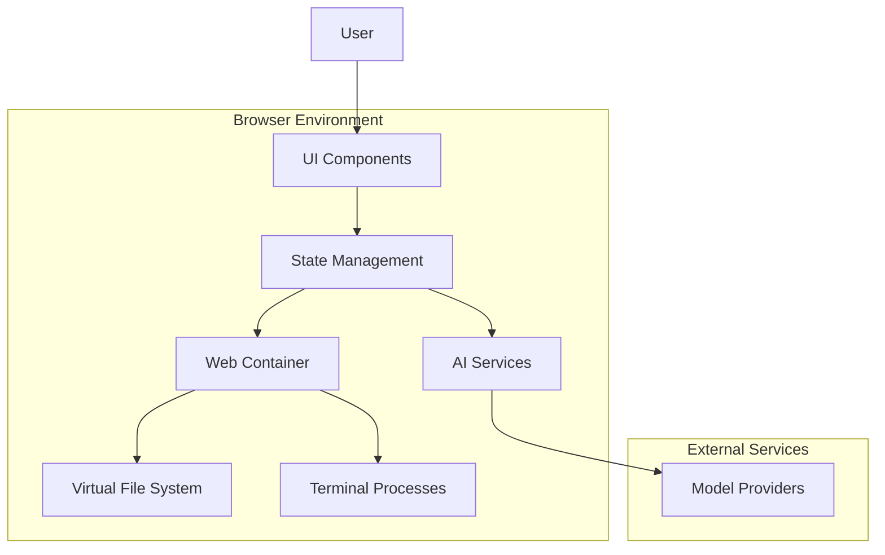
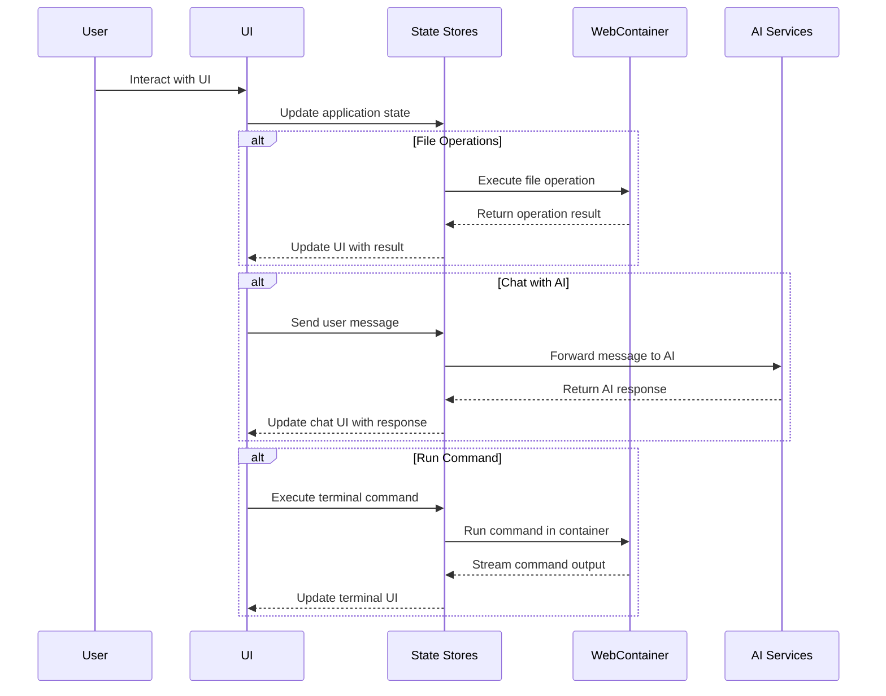
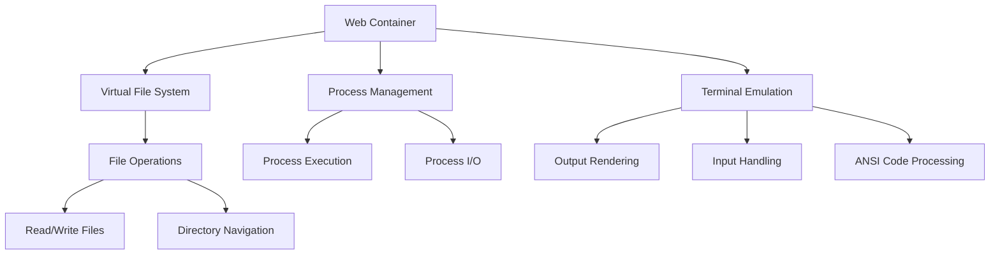
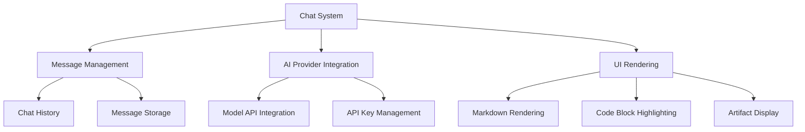
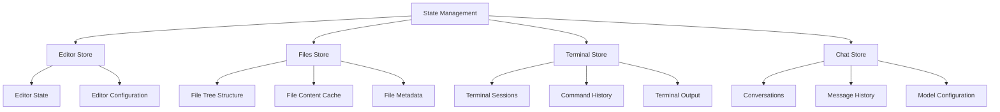
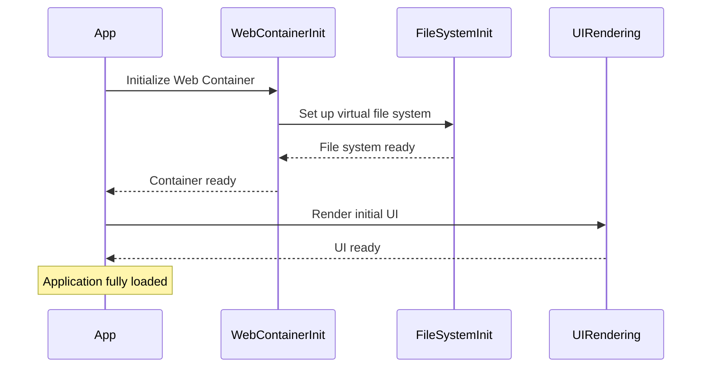

# Application Architecture

This page provides an overview of the bolt.new-any-llm application architecture, including data flow, component interactions, and key subsystems.

## High-Level Architecture

## Data Flow

## Key Subsystems

### Web Container Subsystem

The Web Container provides a browser-based development environment with virtual file system and terminal capabilities.

### Chat and AI Integration

## State Management

The application uses several state stores to manage various aspects of the application:

## Application Bootstrap Flow

