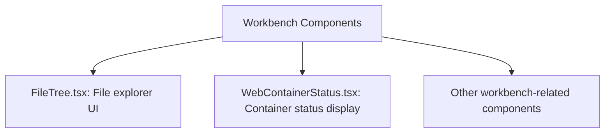
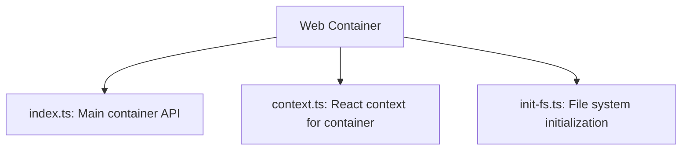
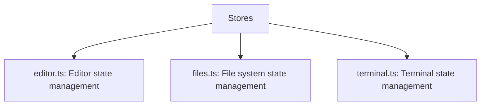
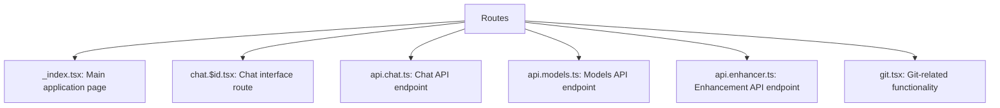

# Core Components

This page describes the main components of the bolt.new-any-llm application.

## Chat Components

Located in `app/components/chat/`

```mermaid
graph TD
    Chat[Chat Components] --> BaseChat["BaseChat.tsx: Core chat functionality"]
    Chat --> Messages["Messages.client.tsx: Message rendering"]
    Chat --> UserMessage["UserMessage.tsx: User message display"]
    Chat --> AssistantMessage["AssistantMessage.tsx: Assistant message display"]
    Chat --> CodeBlock["CodeBlock.tsx: Code rendering with syntax highlighting"]
    Chat --> Markdown["Markdown.tsx: Markdown rendering"]
    Chat --> ModelSelector["ModelSelector.tsx: AI model selection interface"]
    Chat --> APIKeyManager["APIKeyManager.tsx: API key management"]
    Chat --> ExamplePrompts["ExamplePrompts.tsx: Example prompts display"]
    Chat --> GitCloneButton["GitCloneButton.tsx: Git repository cloning"]
    Chat --> ImportFolderButton["ImportFolderButton.tsx: Folder importing"]
    Chat --> SpeechRecognition["SpeechRecognition.tsx: Voice input"]
```

The chat components handle the user interface for interacting with AI models, displaying messages, and managing conversations. These components are responsible for:
- Rendering user and assistant messages
- Processing and displaying markdown and code blocks
- Managing API keys for various AI providers
- Providing speech-to-text capabilities
- Enabling git operations and folder imports

## Workbench Components

Located in `app/components/workbench/`

The workbench components provide the development environment interface, including:
- File tree navigation and management
- Web container initialization and status monitoring
- Code editing capabilities (via editor integration)

## Web Container

Located in `app/lib/webcontainer/`

The Web Container module provides browser-based execution of code, including:
- Virtual file system operations
- Terminal emulation
- Process management
- Integration with the editor and chat components

## State Management (Stores)

Located in `app/lib/stores/`

The stores provide centralized state management for various aspects of the application:
- Editor state and configuration
- File system operations and caching
- Terminal sessions and history

## Routes

Located in `app/routes/`

The routes define the application's URL structure and API endpoints:
- User-facing interfaces
- API endpoints for chat interactions
- Model management endpoints
- Git integration endpoints
