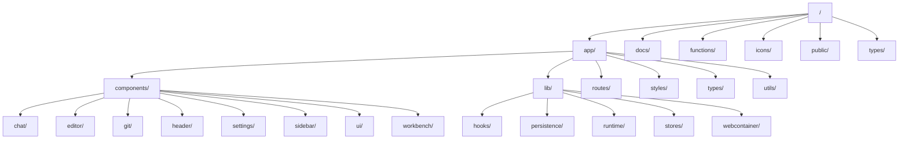

# Project Wiki

Welcome to the bolt.new-any-llm project wiki! This wiki provides documentation about the codebase structure, components, and how different parts of the application work together.

## Project Overview

bolt.new-any-llm is a web application that provides an interactive development environment with chat capabilities powered by AI models. It includes features for webcontainer integration, file management, terminal emulation, and AI-assisted coding.

## Navigation

- [Project Structure](#project-structure)
- [Core Components](#core-components)
- [File Overview](#file-overview)
- [Architecture Diagrams](#architecture-diagrams)

## Project Structure

## Core Components

- **Chat Components**: UI elements for the chat interface and AI interactions
- **Workbench Components**: Code editor, file tree, and web container integration
- **Stores**: State management using React contexts and hooks
- **Web Container**: Browser-based container for running code and terminals
- **Routes**: Application routes and API handlers

## File Overview

This section provides brief descriptions of key files in the project.
