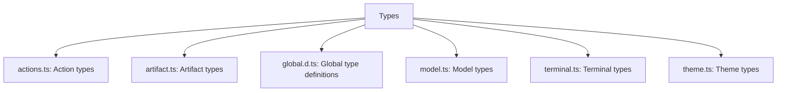

# Utility Modules

This page describes the utility modules and helper functions used throughout the bolt.new-any-llm application.

## Core Utilities

Located in `app/utils/`

```mermaid
graph TD
    Utils[Utilities] --> Buffer["buffer.ts: Buffer operations"]
    Utils --> ClassNames["classNames.ts: CSS class management"]
    Utils --> Constants["constants.ts: Application constants"]
    Utils --> Debounce["debounce.ts: Function debouncing"]
    Utils --> Diff["diff.ts: Content diffing utilities"]
    Utils --> Easings["easings.ts: Animation easing functions"]
    Utils --> FileUtils["fileUtils.ts: File handling utilities"]
    Utils --> FolderImport["folderImport.ts: Folder import helpers"]
    Utils --> Logger["logger.ts: Logging functionality"]
    Utils --> Markdown["markdown.ts: Markdown processing"]
    Utils --> Mobile["mobile.ts: Mobile device detection"]
    Utils --> ProjectCommands["projectCommands.ts: Project command handling"]
    Utils --> Promises["promises.ts: Promise utilities"]
    Utils --> React["react.ts: React utilities"]
    Utils --> Shell["shell.ts: Shell command utilities"]
    Utils --> Terminal["terminal.ts: Terminal utilities"]
```

## File Utilities

The `fileUtils.ts` module provides utilities for handling files and file operations:

- Reading and writing files
- File type detection
- Path manipulation
- File metadata operations

## Shell and Terminal Utilities

The shell and terminal utilities (`shell.ts` and `terminal.ts`) provide:

- Command execution in the web container
- Terminal output processing
- ANSI code handling
- Terminal session management

## Project Commands

The `projectCommands.ts` module contains utilities for:

- Executing predefined project commands
- Setting up project environments
- Installing dependencies
- Running build scripts

## Type Utilities

Located in various files in `app/types/` and `types/`:

These type definition files provide TypeScript interfaces and types used throughout the application, ensuring type safety and code completion.
